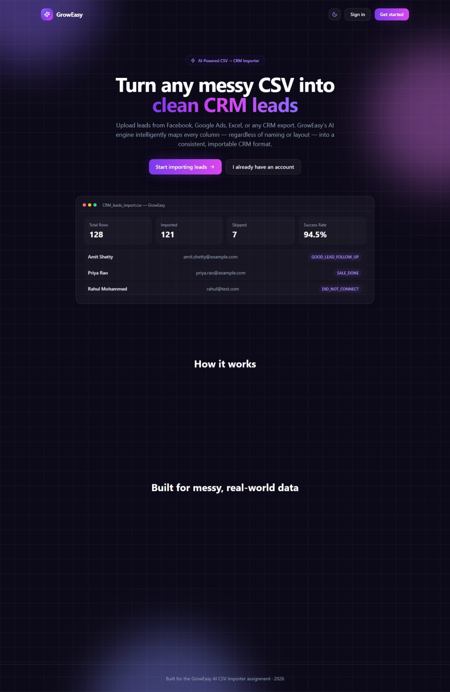
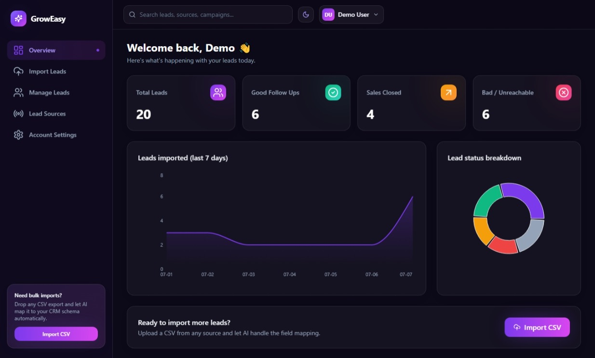
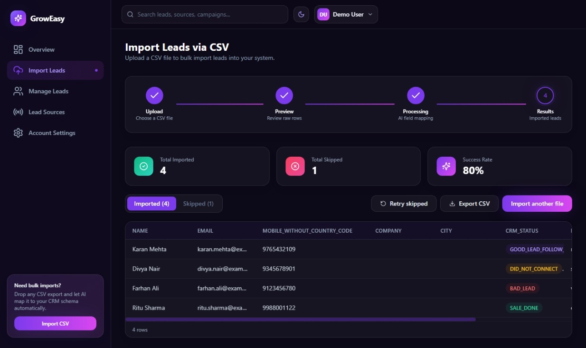
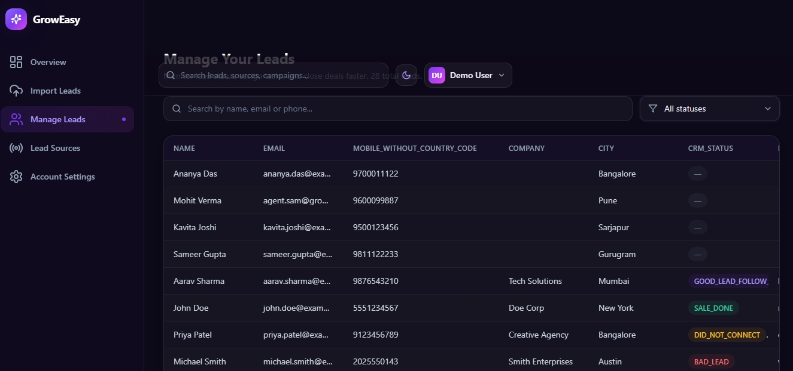
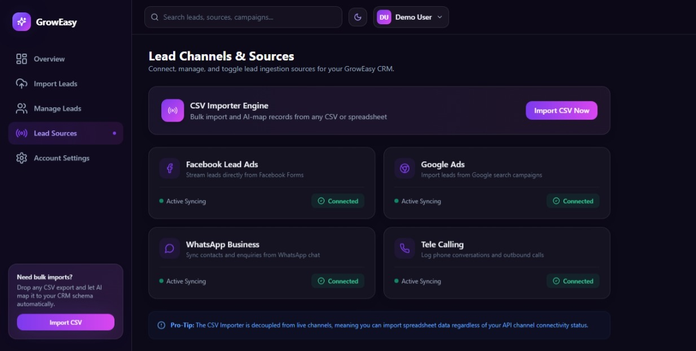
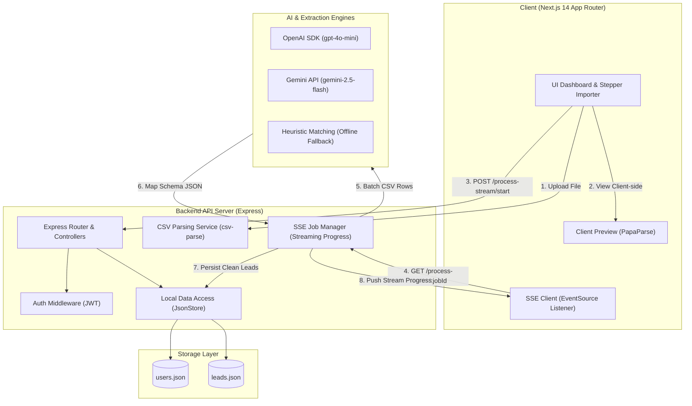

# GrowEasy — AI-Powered CSV Lead Importer

Turn **any** CSV export — Facebook Lead Ads, Google Ads, Excel sheets, real-estate CRM
exports, sales reports, or a spreadsheet someone made by hand — into clean, structured
**GrowEasy CRM** leads, automatically.

The importer doesn't care what your columns are called. An AI extraction engine (with a
deterministic rule-based fallback) intelligently maps whatever headers your file has onto
the fixed CRM schema, skips unusable rows, and reports exactly what happened.

---

## ✨ Features

### Core
- 🖱️ Drag & drop **or** file-picker CSV upload
- 👀 Instant client-side preview in a responsive, scrollable table — **no AI runs yet**
- ✅ Explicit "Confirm & Import" step before any backend/AI call is made
- 🤖 Backend batches rows and sends them to an LLM (OpenAI) for field mapping
- 📊 Results screen with imported vs. skipped records, totals, and success rate
- 🔒 Full authentication (sign up / sign in) protecting the dashboard and API
- 🧭 A real multi-page dashboard: Overview, Import, Manage Leads, Lead Sources, Account

### Bonus points implemented
| Bonus | Status | Where |
|---|---|---|
| Drag & drop upload | ✅ | `frontend/src/components/FileDropzone.tsx` |
| Progress indicators during AI processing | ✅ | Server-Sent Events streamed live to the import wizard |
| Streaming / incremental processing | ✅ | `POST /csv/process-stream/start` + `GET /csv/process-stream/:jobId` (SSE) |
| Retry mechanism for failed AI batches | ✅ | Automatic per-batch retry w/ backoff (`aiExtraction.service.js`) **and** a manual "Retry skipped" button in the UI |
| Virtualized table for large CSVs | ✅ | `react-window` kicks in automatically above 150 rows (`DataTable.tsx`) |
| Dark mode | ✅ | Full app-wide dark/light theme toggle, persisted |
| Unit tests | ✅ | Backend (`jest`) + Frontend (`jest` + Testing Library) |
| Docker setup | ✅ | `Dockerfile` per app + root `docker-compose.yml` |
| Deployment-ready | ✅ | Stateless-friendly backend, `NEXT_PUBLIC_API_URL` config, works on Vercel/Render/Railway |
| Well-written README | ✅ | You're reading it |

### Extra ideas added on top of the brief
- **Graceful AI degradation**: if `OPENAI_API_KEY` isn't set, or a batch fails after all
  retries, the app automatically falls back to a fast, deterministic heuristic engine
  (fuzzy header matching + regex email/phone extraction + status/source keyword mapping)
  so the product is always usable, even offline or without an API key.
- **CSV export** of the final imported CRM records, straight from the results screen.
- **Manage Leads** page with search, status filter, and pagination over everything ever
  imported.
- **Dashboard analytics**: 7-day import trend chart and a status breakdown pie chart.
- Fully responsive, animated UI (Framer Motion, glassmorphism, gradient backgrounds).

---

## 🧱 Tech Stack

| Layer | Tech |
|---|---|
| Frontend | Next.js 14 (App Router), TypeScript, Tailwind CSS, Framer Motion, Recharts, react-dropzone, react-window, PapaParse |
| Backend | Node.js, Express, Multer, csv-parse, JWT, bcrypt |
| AI | OpenAI (`gpt-4o-mini` by default) via the official SDK, with a heuristic fallback engine |
| Storage | Lightweight JSON file store (swap for a real DB if needed — see below) |

---

## 📸 App Screenshots

Here is a visual walkthrough of the GrowEasy CRM and AI Importer:

### 1. Dashboard & Analytics

*The main overview dashboard displaying the 7-day import trend chart, lead status breakdown pie chart, and total leads statistics.*

### 2. Interactive CSV Importer Wizard

*The 4-step smart importer wizard where users can drag and drop CSV files, preview parsed raw data, initiate batch AI mappings, and review import logs.*

### 3. Lead Management Table

*A searchable, paginated, and status-filtered table displaying all processed and imported CRM lead contacts.*

### 4. Lead Ingestion Channels

*Integrations dashboard showing active lead sources such as Facebook Lead Ads, Google Ads, WhatsApp Business, and Tele Calling with dynamic connection status controls.*

### 5. Profile & Application Settings

*Professional profile management workspace displaying verified user details, display theme controls, registration timestamps, and account status.*

---

## 🏗️ Architecture & Data Flow

Below is the high-level architecture diagram detailing how data streams from the client browser through the Express API server, processes batch requests through LLM models (OpenAI or Gemini), and stores results locally.



### Key Components

1. **Frontend Client (Next.js 14 App Router)**
   - **Local File Processing**: Uses `PapaParse` to parse files directly in the browser for instant client-side preview tables (virtualized with `react-window` for speed).
   - **Progress Streaming**: Listens to Server-Sent Events (SSE) from the backend to display real-time progress bars, batch statuses, and extraction rates.

2. **Backend Server (Express)**
   - **Streaming Ingestion**: Initiates short-lived session jobs using a `jobStore` and streams batch results incrementally over a single HTTP connection.
   - **Fallback Architecture**: A dual-provider AI connector supporting OpenAI (`gpt-4o-mini`) and Gemini (`gemini-2.5-flash`), with automatic retries and a local Heuristic Engine fallback.

3. **Storage (JSON DB)**
   - Minimal file-backed `JsonStore` persistence to read/write `users.json` and `leads.json` instantly with zero database setup.

---

## 📁 Project Structure

```
groweasy-csv-importer/
├── backend/
│   ├── src/
│   │   ├── controllers/      # auth, csv, leads
│   │   ├── services/         # csvParser, aiExtraction (prompting/batching/retries), jobStore
│   │   ├── middleware/       # auth (JWT), upload (multer), error handling
│   │   ├── routes/
│   │   ├── utils/            # JSON store + heuristic matching engine
│   │   └── server.js
│   ├── tests/                # jest unit tests for the heuristic engine
│   ├── data/                 # users.json / leads.json (generated at runtime)
│   └── Dockerfile
├── frontend/
│   ├── src/
│   │   ├── app/
│   │   │   ├── page.tsx                 # marketing landing page
│   │   │   ├── login/, signup/          # auth pages
│   │   │   └── dashboard/
│   │   │       ├── page.tsx             # overview + charts
│   │   │       ├── import/page.tsx      # the core 4-step CSV importer
│   │   │       ├── leads/page.tsx       # manage leads table
│   │   │       ├── settings/page.tsx    # lead sources
│   │   │       └── account/page.tsx
│   │   ├── components/                  # Sidebar, Topbar, DataTable, FileDropzone, Stepper...
│   │   ├── context/                     # AuthContext, ThemeContext
│   │   └── lib/                         # api client, csv helpers, types
│   ├── __tests__/
│   └── Dockerfile
├── docker-compose.yml
└── README.md
```

---

## 🚀 Getting Started (local, without Docker)

### Prerequisites
- Node.js 18+
- (Optional) An OpenAI API key — the app works without one, using the heuristic fallback.

### 1. Backend

```bash
cd backend
cp .env.example .env
# Optionally edit .env and set OPENAI_API_KEY=sk-...
npm install
npm run dev        # starts on http://localhost:5000
```

### 2. Frontend

```bash
cd frontend
cp .env.example .env.local
npm install
npm run dev         # starts on http://localhost:3000
```

Open **http://localhost:3000**, sign up for an account, and try the importer from
**Dashboard → Import Leads**.

### 3. Run tests

```bash
# Backend
cd backend && npm test

# Frontend
cd frontend && npm test
```

---

## 🐳 Running with Docker

```bash
# from the project root
cp backend/.env.example .env   # docker-compose reads JWT_SECRET / OPENAI_API_KEY from here
docker compose up --build
```

- Frontend: http://localhost:3000
- Backend:  http://localhost:5000

Leads/user data persist in a named Docker volume (`backend-data`) between restarts.

---

## 🔑 Environment Variables

### `backend/.env`
```
PORT=5000
CLIENT_ORIGIN=http://localhost:3000
JWT_SECRET=super-secret-change-me
JWT_EXPIRES_IN=7d

AI_PROVIDER=openai
OPENAI_API_KEY=              # leave blank to use the heuristic fallback engine
OPENAI_MODEL=gpt-4o-mini

AI_BATCH_SIZE=20              # rows sent to the AI per request
AI_MAX_RETRIES=3              # retries per batch before falling back
AI_CONCURRENCY=3              # batches processed in parallel
```

### `frontend/.env.local`
```
NEXT_PUBLIC_API_URL=http://localhost:5000/api
```

---

## 🤖 How the AI field mapping works

1. The frontend parses the CSV **client-side** purely for preview — headers can be
   anything, nothing is sent to the backend yet.
2. On **Confirm & Import**, the raw rows + original headers are sent to
   `POST /api/csv/process-stream/start`, which registers a short-lived job and hands back
   a `jobId`.
3. The frontend opens an `EventSource` to `GET /api/csv/process-stream/:jobId`, which:
   - Splits rows into batches (`AI_BATCH_SIZE`, default 20).
   - Sends each batch, with the original headers, to the LLM using a carefully engineered
     system prompt that encodes the full GrowEasy CRM schema, the four allowed
     `crm_status` values, the five allowed `data_source` values, and rules for handling
     multiple emails/phones, missing dates, and rows with no contact info.
   - Retries a failed batch up to `AI_MAX_RETRIES` times with exponential backoff.
   - If a batch still fails (or no `OPENAI_API_KEY` is configured at all), it falls back to
     a deterministic heuristic engine that fuzzy-matches headers to CRM fields and extracts
     emails/phone numbers with regex — so results are still returned, just without LLM
     reasoning.
   - Emits a `progress` SSE event after every batch (imported/skipped counters, which mode
     was used) so the UI can show a live progress bar.
   - Emits a final `done` event with all records, all skipped rows (with reasons), and
     metadata about which AI mode was used.
4. Imported records are persisted to `backend/data/leads.json` and immediately browsable
   under **Manage Leads**.

---

## 🗄️ On the database

The brief allows a stateless app or "any database if required." This project ships with a
tiny JSON-file store (`backend/src/utils/store.js`) so it runs with zero setup and still
survives restarts. Swapping it for Postgres/Mongo is a matter of reimplementing that one
module — every controller only calls `.read()`, `.push()`, `.pushMany()`, `.filter()`.

---

## ☁️ Deployment notes

- **Frontend** → Vercel: set `NEXT_PUBLIC_API_URL` to your deployed backend URL.
- **Backend** → Render / Railway: set `CLIENT_ORIGIN` to your deployed frontend URL, and
  add `OPENAI_API_KEY` if you want real LLM extraction instead of the heuristic fallback.
- Both apps also build and run happily via the included Dockerfiles / `docker-compose.yml`.

---

## 🧪 What to try

1. Sign up, land on the dashboard.
2. Go to **Import Leads**, drop in a CSV with completely different column names each time.
3. Watch the preview (no AI yet), confirm, watch the live progress bar batch through your
   rows, then review Imported vs. Skipped, export the cleaned CSV, or retry skipped rows.
4. Check **Manage Leads** — everything you imported is there, searchable and filterable.
